\clearpage

変更履歴

|バージョン|更新日|更新内容|
|:---|:---|:---|
|0.9.0|2017/9/25|初版|
|0.9.1|2017/10/18|Nova-LXDの取り扱い方,Nova-KVMとの共存について追記|

````
筆者注:このドキュメントに対する提案や誤りの指摘は
Issue登録か、日本仮想化技術までメールにてお願いします。
https://github.com/virtualtech/jujumaas-openstack/issues
````

\clearpage

## 構築スクリプト

手順4.2から手順5.2までの処理をまとめた構築スクリプトを以下のリポジトリーで開発しています。

### 安定版リポジトリー

* <https://github.com/virtualtech/jujumaas-openstack>

### 開発版リポジトリー

* <https://bitbucket.org/ytooyama/juju-maas/>

\clearpage

本書では、Canonicalが提供するUbuntu JujuとMAAS環境を利用して、OpenStackをデプロイするまでの手順を解説します。


## 1. JujuとMAAS

### 1.1 Jujuとは

Canonicalが提供するJujuは、アプリケーション実行環境とアプリケーションのデプロイメントをするためのソフトウェアです。
Amazon EC2やMicrosoft Azure、Google Cloud PlatformといったパブリッククラウドやOpenStackといったプライベートクラウド、ローカル環境上のLinux Containerなどに対応しています。
これらのサービスに対してJujuのコマンドやGUIによる操作でアプリケーションの配備や設定を自動化することができます。

Jujuを実行するクライアントとサービスプロパイダーはbootstrapを経由して制御します。
最終的にデプロイしたいアプリケーションやアプリケーションをデプロイしたいサービスプロパイダーによって少々異なるものの、次のような流れでアプリケーションのデプロイメントが可能です。

```
juju bootstrap 〜    #クラウドやサービスと接続
juju deploy app-1　  #app-1のデプロイ
juju deploy app-2　  #app-2のデプロイ
juju add-relation app-1 app-2   #app-1と2の接続とアプリケーションの構成の適用 
```

JujuにはCharmとBundleという概念があります。Charmはアプリケーションのインストールの手順書や設定、テンプレートなどがパッケージングされたものです。
様々なアプリケーションをデプロイすることができるCharmが提供されています。
Bundleは簡単に説明すると、複数のCharmの集合体です。Charmをデプロイメントする感覚でBundleを利用することで、複数のアプリケーションからなるアプリケーションシステムのプロビジョングが可能になります。

どのようなアプリケーションが利用可能か、どのようなBundleが提供されているかは「jujucharms.com」で確認できます。

次に述べる、同じくCanonicalが開発するMAASと組み合わせて使うことにより、所有する物理サーバーや仮想サーバーを利用した単体のWebアプリケーションから
OpenStack、Hadoopといったような大規模アプリケーションのプロビジョニングが可能になります。

\clearpage

### 1.2 MAASとは

Canonicalが提供するMAASは、ノードとネットワークの管理、オペレーティングシステムをデプロイメントをするためのソフトウェアです。
初期のMAASではベアメタルプロビジョニングを行うためのソフトウェアでしたが、現在利用できるMAAS 1.9や2.xではLinux KVMやVMware ESXiをサポートしています。
これらのハイパーバイザーで仮想マシンを作成して、その仮想マシンを物理サーバーと同様にMAASで利用、管理することができます。

MAASは内部でDHCPやDNS、PostgreSQLやPXEといったサーバーが動作しています。これらを組み合わせてノードのネットワークの管理やOSのプロビジョニングを実現しています。

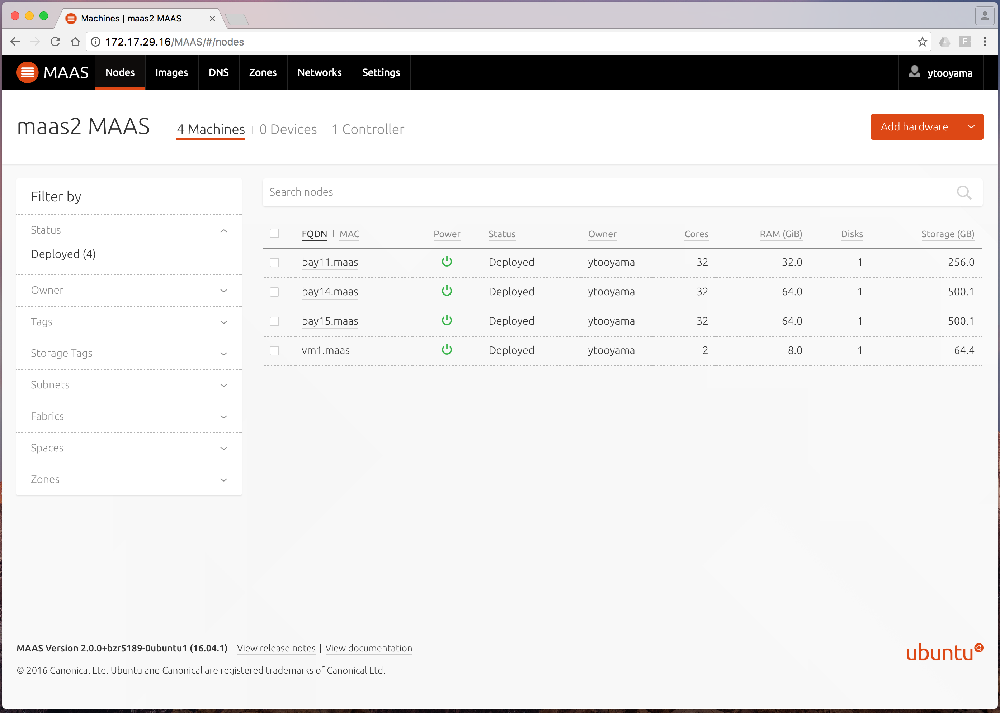
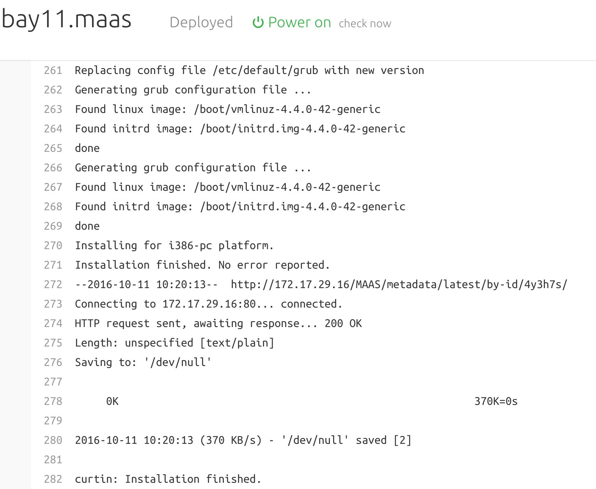

\clearpage


## 2. 必須要件

環境構築の前に、本書の構成でOpenStack環境を構築する場合に最低限必要なハードウェアについて説明します。


### 2.1 ネットワーク

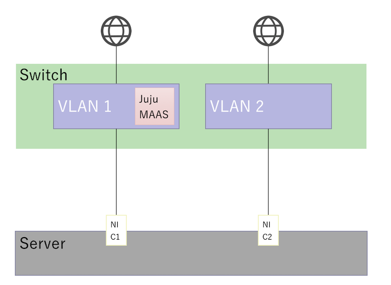

* 2つのVLANを用意します。
  * 本書ではUnTag VLANを想定しています。
  * 全てのサーバーで両ネットワークに接続します。
  * ともにインターネットに接続できる必要があります。
* VLAN1側はJuju/MAASやOpenStackの管理用として利用します。
* VLAN2側はOpenStackのExternal用として利用します。
  * DHCPが稼働していない必要があります。


### 2.2 MAAS

MAASを実行するサーバーは物理サーバーでも仮想マシンでも構いません。本書が想定するMAAS 2系を使う場合はUbuntu 16.04の最新版を利用することで導入可能です。

MAASの実行に最低限必要なマシン性能は次の通りです。仮想マシンで動作させるにはブリッジ接続が必要です。

* 2vCPU
* 8GBメモリー
* 30GB程度のストレージ
* NIC x1 (2.1の図のVLAN1側と接続します)

本書では[パッケージを使ってMAASをインストール](https://docs.ubuntu.com/maas/2.2/en/installconfig-package-install)することを想定しています。


### 2.3 Jujuクライアント

Jujuのコマンド操作を行うクライアントはMAASサーバーやMAASサーバーで管理するネットワークと接続できる必要があります。
Jujuクライアントは複数のオペレーティングシステム向けパッケージが利用可能ですが、本例ではUbuntu 16.04の最新版を利用します。

本書ではMAASサーバー上にJujuクライアントをインストールします。

\clearpage


### 2.4 物理サーバー

最小、3つの物理サーバーを用意します。物理サーバーに使用するストレージはSSDを推奨します。

本例ではLinux Containerを使ったOpenStackのデプロイメントを想定したために次のような性能のマシンを用意しましたが、アプリケーションのデプロイ先をうまく分散することによって、1台あたりに必要とするマシン性能を落とすことが可能です。ただし、ストレージについてはSSDを使うことを**強く推奨**します。

* 32Core CPU
* 32GBメモリー
* 256GB SSD
* NIC x2

\clearpage


## 3. MAASのセットアップ

Juju 2.0はMAASの1.9系と2.x系に対応しています。
本例ではMAAS 2.xをインストールするため、Ubuntu Server 16.04の最新版をインストールします。


### 3.1 ダウンロードとセットアップ

Ubuntu Server 16.04のインストールイメージは[公式サイト](https://www.ubuntu.com/download/server)からダウンロードできます。

* <https://www.ubuntu.com/download/server>

ダウンロードしたISOイメージをDVDイメージに書き込んだメディアを用意し、DVDブートしてください。
Ubuntu Server 16.04は最小インストールを行い、セットアップ時にはOpenSSH serverを追加してください。

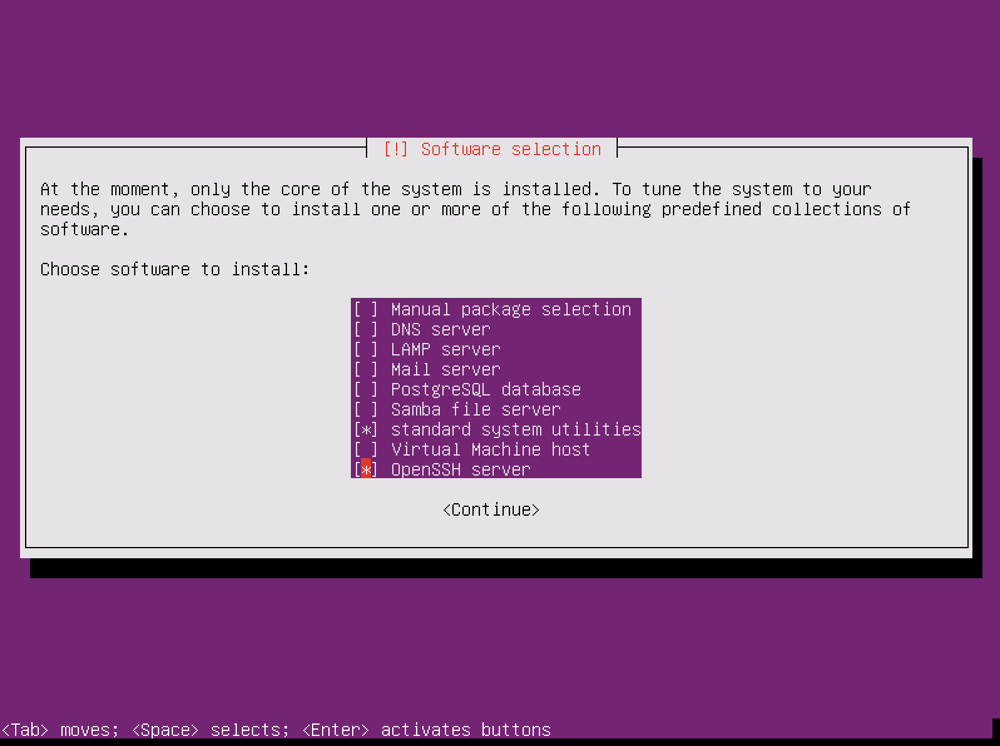

インストール後に再起動します。
Ubuntu Server 16.04が起動したらユーザーログインして次のコマンドを実行し、ソフトウェアアップデートを行います。
Linuxカーネルの更新パッケージがあった場合は再起動します。

```
% sudo apt update 
% sudo apt -y upgrade
```


### 3.2 MAASのインストール

MAASのインストール手順は[公式サイト](https://docs.ubuntu.com/maas/2.2/en/installconfig-package-install)に従います。

* <https://docs.ubuntu.com/maas/2.2/en/installconfig-package-install>


\clearpage


### 3.3 MAASへのログイン

MAASへのログインまでの手順は[公式サイト](http://maas.io/docs/en/installconfig-gui)に従います。

* <http://maas.io/docs/en/installconfig-gui>

MAASへログインするには管理ユーザーをまず登録する必要があります。
MAASサーバーで次例のようにコマンドを実行して、MAAS管理者を登録します。

```
% sudo maas createadmin --username=admin --password=password --email=admin@example.com
```

ブラウザーを開いてロケーションバーに`http://<region controller address>/MAAS`を入力してMAASダッシュボードにアクセスします。
先の手順で登録したユーザーとユーザーに対して設定したパスワードを入力します。


### 3.4 MAASのDHCPネットワーク設定

MAASはDHCPサーバーとDNSサーバーを使って、ノードに対してネットワークの設定と名前引きの設定を行っています。
インストール直後はDHCPサーバーが動作していないため、そのための設定を行います。

本例ではMAASをシングルノードでインストールした場合の手順を記述します。

* MAASダッシュボードにログインします。
* 上部メニューのNetworksをクリックします。
* Networksから管理用として利用するネットワークサブネットをクリックします。

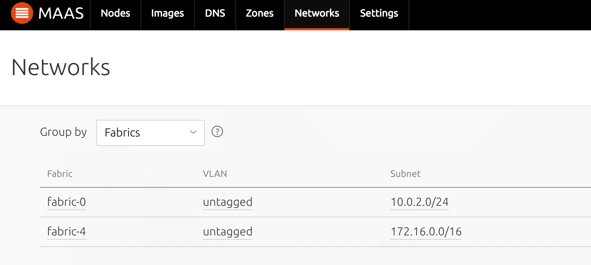

* サブネットのサマリー情報画面が表示され、ネットワークの使用状況などが確認できます。


* Reservedの項目で「Reserve range」か「Reserve dynamic range」のボタンを押下します。
* 確保するIPアドレスの範囲を指定します。ここで指定したIPアドレスを除くIPアドレスの範囲がMAAS用として利用されます。すでに使用中のIPアドレスはUsedに一覧表示されます。

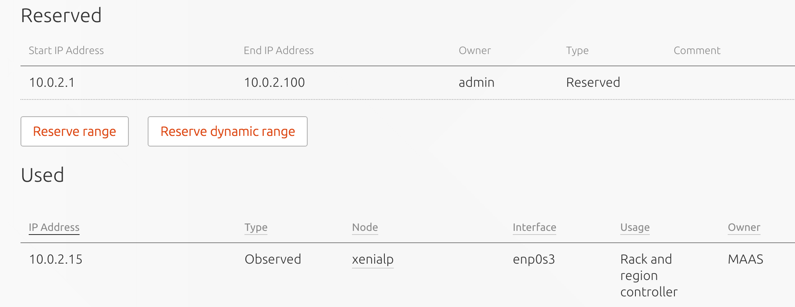


* Networks画面に戻り、DHCPサーバーを動かすネットワークサブネットのVLANの項目をクリックします。


* Default VLAN in fabric-X画面が表示されます。
* Take actionを押下してProvide DHCPを選択します。

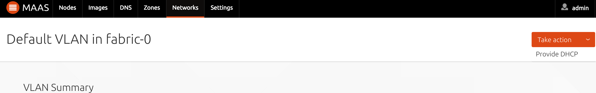


* DHCPの範囲を設定したあと「Provide DHCP」ボタンを押下します。

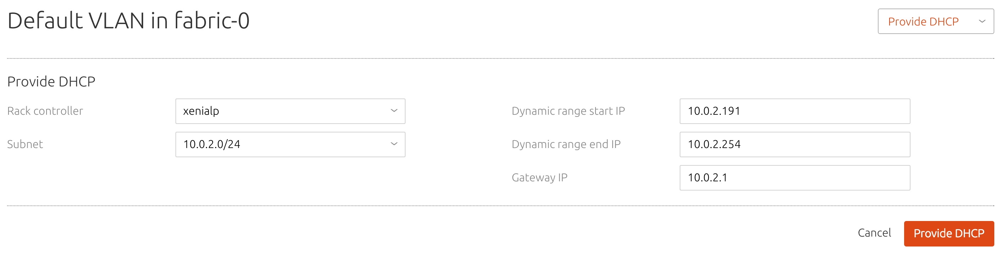

\clearpage

### 3.5 MAASコントローラーの確認

MAASノードのコントローラーを選択して、RegionコントローラーとRackコントローラーの状態を確認します。

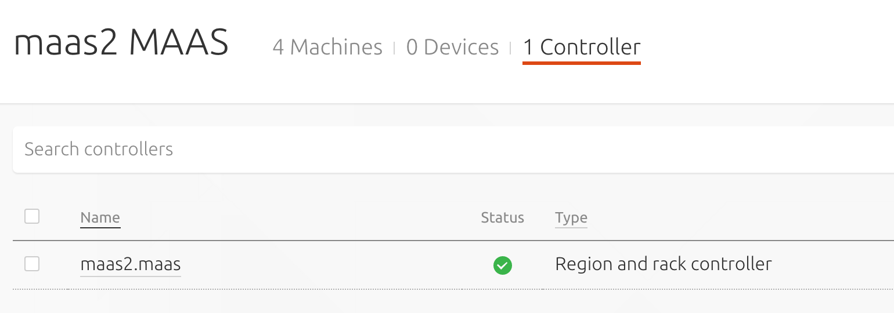

DHCPサーバーが起動しているか確認します。本例ではIPv6を使わないため、dhcp6にチェックが入っていなくても問題ありません。

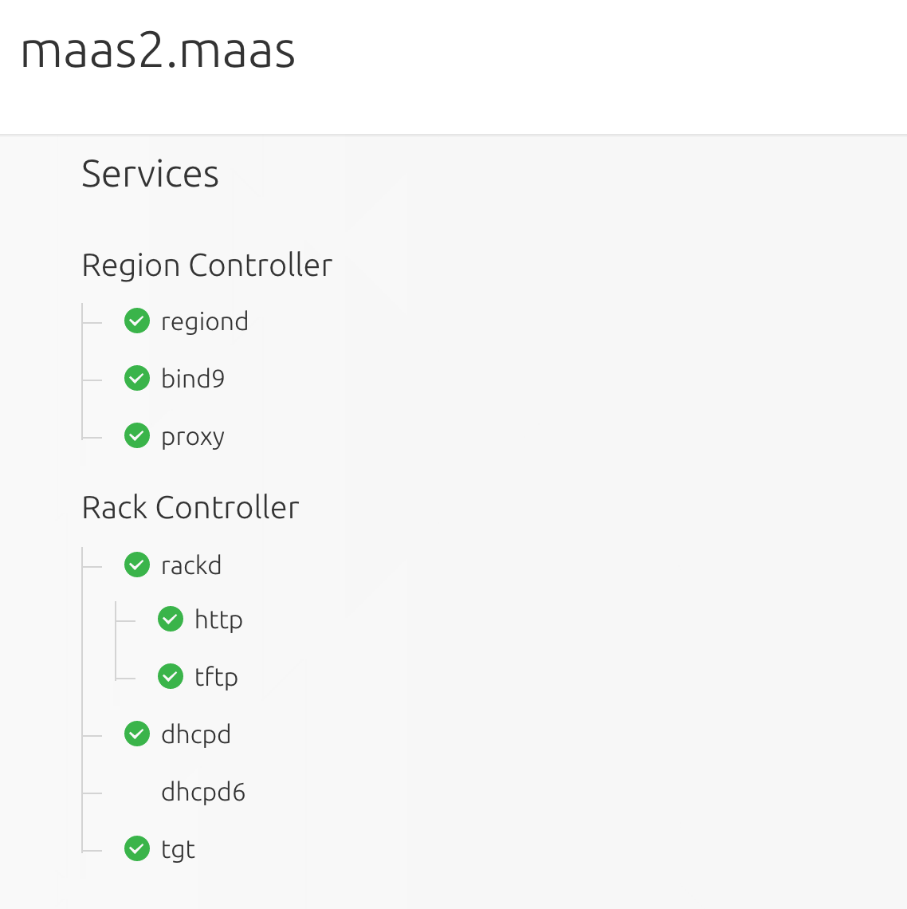


\clearpage

### 3.6 MAASへノードの登録

MAASに物理マシンを登録するには、物理サーバーのネットワークの設定でMAASの管理用ネットワークと同じセグメントに接続します。
IPMI通信に対応する物理サーバーであれば、電源をオンにするだけでMAAS管理下にサーバーを追加するための「Enlist」という処理が走ります。

この処理を行うために、MAAS管理用ネットワークとBMC NICに設定したネットワークIPアドレス間で疎通できる必要があります。
そのような環境を用意できない場合は、物理サーバーのBMC NICをMAAS用のネットワークに接続してください。
また、サーバーのBMC NICのIPアドレスをそのセグメント内のものに変更してください。

「Enlist」の処理が終わるとサーバーは自動的に電源がオフになり、MAASのノード一覧に登録されます。
ノードは大抵XXXXX.maasというランダム生成した名前で登録されますので、その名前をクリックして次の画面に切り替えたら必要に応じて、適切な名前に変更してください。


### 3.7 MAASへ仮想ノードの登録

仮想マシンをMAASに登録するには、次の手順(Ubuntu MAAS 1.9 クイックセットアップガイドの「ESXi VMをMAASで利用する」または「KVM VMをMAASで利用する」)
以降の手順に従ってください。本書では説明を省略します。

* <https://github.com/ytooyama/MAAS-Docs-ja/blob/master/maas19-quickguide.md>

\clearpage

### 3.8 ノードへのタグの設定

JujuとMAASを連携した場合にJujuコマンドを使ってサーバーを識別するため、MAASのタグ機能を使います。
通常はなにも指定せずに`juju bootstrap`コマンドや`juju deploy`コマンドを実行すると利用していないノードをランダムに利用します。
これを必要なサーバーに必要な役割を担わせるため、タグでサーバーを識別するように設定しましょう。

設定は非常に簡単で、ノードをクリックして「Machine summary」の右横の「Edit」ボタンを押下し、「Tags」にタグを設定します。タグは複数指定できます。

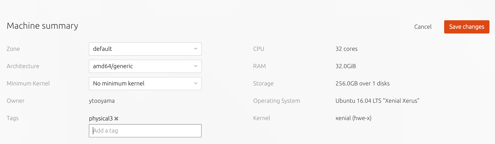

本書では次のようなマシンの登録とそのノードへタグを設定する構成を想定しています。
OpenStackのコンポーネントの多くをphysical1と2にデプロイするため、性能の良いものをおすすめします。
Nova-LXD構成でデプロイしたい場合は、そのノードにUbuntuシステムをデプロイするためのディスクの他、LXD用のストレージが別途必要です。

|マシン種類|タグ|スペック|用途|
|-|-|-|-|
|物理サーバー|physical0|4Core CPU/24GBメモリー/146GB|Bootstrap|
|物理サーバー|physical1|32Core CPU/64GBメモリー/256GB|システムデプロイ用|
|物理サーバー|physical2|32Core CPU/64GBメモリー/256GB|システムデプロイ用|
|物理サーバー|physical3|4Core CPU/24GBメモリー/146GB|Compute KVM|
|物理サーバー|physical4|16Core CPU/32GBメモリー/システム用300GB,LXD用300GB|Compute LXD|


\clearpage


## 4. Jujuクライアントのセットアップ

### 4.1 Jujuクライアントのインストール

MAASのセットアップが終わったら次にJujuのセットアップを行います。
次のようにUbuntu Server 16.04の最新版をインストールして、Jujuをインストールします。

```
% sudo add-apt-repository ppa:juju/stable
% sudo apt update
% sudo apt -y install juju 
```


### 4.2 JujuとMAASの連携

MAASとJujuを連携するためにはまずyamlファイル(下記例)を作成します。

```
clouds:
   maas: ←これが「cloud name」
      type: maas
      auth-types: [oauth1]
      endpoint: http://maas-ip/MAAS
```

MAAS cloudをJujuで制御できるようにするため、`juju add-cloud`コマンドを実行します。
`juju list-clouds`コマンドで登録されたことを確認します。

```
% juju add-cloud <cloudname> <YAML file>
% juju clouds  ←確認
```

\clearpage


MAASの認証情報(ユーザー、APIキー)を次のコマンドで追加します。
実行するとMAAS APIキーの入力を求められます。
キーは`sudo maas-region apikey --username=<user>`コマンドを実行して確認できます。

```
% juju add-credential maas
Enter credential name: ytooyama   ←認証用のユーザーを指定
Using auth-type "oauth1".
Enter maas-oauth: xxxxxxxxxxxxxxxxxxxx ←MAAS keysを入力(コピペ可能)
Credentials added for cloud maas.

% juju credentials --format yaml --show-secrets  ←確認
credentials:
  maas:
    ytooyama:
      auth-type: oauth1
      maas-oauth: xxxxxxxxxxxxxxxxxxxx
```

最後にjuju bootstrapを実行します。Juju 2.x系ではJuju-GUIは自動的に組み込まれます。
本例ではphysical0タグを指定したノードにbootstrapを導入することを想定しているので、次のようにパラメーターを指定してコマンドを実行します。

```
% juju bootstrap --constraints tags=physical0 maas maas
```

bootstrapプロセスが任意のノードで無事起動すると、Juju-GUIが利用できるようになります。
Juju-GUIのアクセスURLと認証情報は`juju gui`コマンドで確認できます。

```
% juju gui --no-browser
GUI 2.9.2 for model "admin/openstack" is enabled at:
  https://172.17.29.221:17070/gui/u/admin/openstack
Your login credential is:
  username: admin
  password: ef3fd17a280cc9a774d4e939653192e8
```

\clearpage


### 4.3 Juju Machineのデプロイ

Juju 2.0では、アプリケーションとサービスプロバイダーはモデルというもので管理します。
現在Jujuに登録されたモデルは`juju models`コマンドを使うことで確認できます。

```
% juju models
Controller: maas

Model       Cloud/Region  Status     Machines  Cores  Access  Last connection
controller* maas          available         1      4  admin   just now
default     maas          available         0      -  admin   2017-09-19
```

モデルを切り替えるには`juju switch`コマンドを実行します。
controllerというモデルは、bootstrapが実行されているノードを管理しているモデルです。次のように実行すると、マシン0のステータスが確認できます。

```
% juju switch controller
% juju status
Model       Controller  Cloud/Region  Version  SLA
controller  maas        maas          2.2.4    unsupported

App  Version  Status  Scale  Charm  Store  Rev  OS  Notes

Unit  Workload  Agent  Machine  Public address  Ports  Message

Machine  State    DNS            Inst id  Series  AZ       Message
0        started  172.17.29.221  4x77nc   xenial  default  Deployed

```

もう少し踏み込んでみましょう。Jujuクライアントマシンで次のように実行すると、Juju Machine 0にログインすることができます。

```
% juju ssh 0
Welcome to Ubuntu 16.04.3 LTS (GNU/Linux 4.4.0-96-generic x86_64)
...
```

\clearpage

juju sshコマンドに続けてコマンドを指定すると、リモートログインしてコマンドを実行して切断といった処理をまとめて行うことができます。

```
% juju ssh 0 ps aux|grep jujud
root  5946  0.0  0.0  18036  2852 ?   Ss Sep19   0:00 bash /var/lib/juju/init/jujud-machine-0/exec-start.sh
root  5952  2.1  0.6 793136 166476 ?  Sl Sep19 182:12 /var/lib/juju/tools/machine-0/jujud machine --data-dir /var/lib
Connection to 172.17.29.221 closed.
```

Juju 1.X系ではbootstrapとアプリケーションが同列に展開されたため、一度全てのアプリケーションを消すとbootstrapのデプロイからやり直す必要がありました。
Juju 2.X系ではbootstrapとアプリケーションが別々のモデルとして存在するため、トライアンドエラーがやりやすくなっています。

なにもモデルを指定せずに`juju deploy`コマンドを実行するとdefaultというモデルが作成されて、そこにJuju Machineが登録されます。
ここではopenstackというモデルを作成して、リソースはそのモデルで管理するようにしましょう。次のように実行します。
このようにアプリケーションごとにモデルを設定しておくと、jujuからいろいろなアプリケーションのデプロイ、管理を一つのクライアントから実行できます。

```
% juju add-model openstack
% juju switch openstack
```

Juju MachineとMAAS上のノードを紐付けするには`juju add-machine`コマンドを実行します。
このコマンドの実行によりノードの電源が入り、なにもアプリケーションが導入されていないUbuntu Serverがデプロイメントされます。
現時点のJuju 2.0ではUbuntu Server 16.04がデプロイされます。

マシンはMAASでノードごとに指定したタグを使って識別することができます。
次のように実行するとMAASでphysical1...physical4タグを指定したノードをjujuコマンド一つで起動して、OSのプロビジョニングまで行うことができます。

```
% juju add-machine --constraints tags=physical1
% juju add-machine --constraints tags=physical2
% juju add-machine --constraints tags=physical3
% juju add-machine --constraints tags=physical4
```

Juju Machineのセットアップ状況は`juju status`コマンドで確認できます。

\clearpage


## 5. OpenStackのデプロイ

### 5.1 OpenStack Charmのデプロイ

`juju add-machine`コマンドによるJujuマシンのデプロイが終わったら、`juju deploy`コマンドでアプリケーションをデプロイメントします。
`juju deploy`コマンドはオプションを指定しない場合はデフォルトの構成で未使用のノードの物理サーバー上にデプロイします。
今回は物理サーバー3台で複数のOpenStackのコンポーネントをインストールするため、コンテナーと物理サーバー上にデプロイします。

Jujuで特定のノードにアプリケーションをデプロイしたりユニットを追加してスケールする場合、--toオプションを使ってデプロイ先を指定することができます。
--toオプションの後にJujuマシンの番号を指定したり、lxd:Xのように指定してコンテナーにデプロイしたり、MAASと連携している場合は`juju deploy percona-cluster --to host.maas`のように指定することもできます。

本例ではNova ComputeとNeutron Gatewayを物理サーバーに構築し、そのほかのコンポーネントは各サーバーに分散するようにコンテナーにデプロイします。
一つのコマンドを実行するごとに、`juju status`コマンドやJuju GUIでデプロイの進捗を確認してください。
さらにもう一つ端末を実行して`juju debug-log`コマンドを実行するともう少し詳細なデプロイの状況を確認できます。

```
% juju deploy --config openstack.yaml cs:xenial/neutron-gateway-238 --to 1

% juju deploy cs:xenial/rabbitmq-server-65 --to lxd:1 &&
% juju add-unit rabbitmq-server --to lxd:2

% juju deploy --config openstack.yaml cs:xenial/nova-cloud-controller-300 --to lxd:1

% juju deploy --config openstack.yaml percona-cluster --to lxd:1 &&
% juju add-unit -n1 percona-cluster --to lxd:2 && juju config percona-cluster min-cluster-size=2

% juju deploy --config openstack.yaml cs:xenial/glance-259 --to lxd:1
% juju deploy --config openstack.yaml cs:xenial/keystone-268 --to lxd:2

% juju deploy --config openstack.yaml cs:xenial/openstack-dashboard-250 --to lxd:1
% juju deploy --config openstack.yaml cs:xenial/neutron-openvswitch
% juju deploy --config openstack.yaml cs:xenial/neutron-api-252 --to lxd:2
```

デプロイに利用しているopenstack.yamlは次のような内容のものを用意します。
設定できるパラメーターは[jujucharms.com](https://jujucharms.com)でCharmを検索し、config.yamlを開くと確認できます。

\clearpage


```
percona-cluster:
     max-connections: 10000
     ha-bindiface: eth0
     vip_iface: eth0
     root-password: password

keystone:
    openstack-origin: "cloud:xenial-pike"
    admin-password: password
    admin-token: ubuntuopenstack
    preferred-api-version: 2

nova-cloud-controller:
    openstack-origin: "cloud:xenial-pike"
    network-manager: Neutron
    console-access-protocol: "spice"

nova-compute:
    openstack-origin: "cloud:xenial-pike"
    enable-live-migration: yes
    enable-resize: yes

nova-compute-lxd:
    openstack-origin: "cloud:xenial-pike"
    enable-live-migration: yes
    enable-resize: yes
    virt-type: lxd

nova-compute-kvm:
    openstack-origin: "cloud:xenial-pike"
    enable-live-migration: yes
    enable-resize: yes
    virt-type: kvm

neutron-api:
    openstack-origin: "cloud:xenial-pike"
    enable-dvr: no
    flat-network-providers: physnet1
    l2-population: no
    network-device-mtu: 1400
    neutron-plugin: ovs
    neutron-security-groups: yes
    overlay-network-type: vxlan

neutron-gateway:
    openstack-origin: "cloud:xenial-pike"
    bridge-mappings: physnet1:br-ex
    data-port: br-ex:eth1
    instance-mtu: 1400
    plugin: ovs

neutron-openvswitch:
    bridge-mappings: physnet1:br-ex
    data-port: br-ex:eth1
    flat-network-providers: physnet1

glance:
    openstack-origin: "cloud:xenial-pike"

openstack-dashboard:
    openstack-origin: "cloud:xenial-pike"
    webroot: /
    ubuntu-theme: "yes"
```

openstack.yaml記述のポイントは、data-portで指定している物理NICのデバイス名です。
本例ではeth1を指定していますが、MAASのバージョンやサーバーハードウェアによって違うデバイス名で認識されることがあります。
eth1となっている部分を例えばem2とかeno2のように、環境に合わせて設定してください。

openstack-originで指定するのはOpenStackのバージョンです。
本例ではPikeバージョンのインストールを想定するので"cloud:xenial-pike"を指定しています。

network-device-mtuはNeutronネットワーク側に設定するMTUの値であり、instance-mtuはインスタンスのNICに設定するMTUの値です。

\clearpage


### 5.2 Nova-KVM Charmのデプロイ

次のコマンドでKVMモードのComputeをデプロイします。Nova-KVMかNova-LXDのいずれかが必要です。共存も可能です。

```
% juju deploy --config openstack.yaml nova-compute nova-compute-kvm --to 3
```

\clearpage


### 5.3 Nova-LXD Charmのデプロイ

次のコマンドでLXDモードのComputeをデプロイします。Nova-LXDかNova-KVMのいずれかが必要です。共存も可能です。

```
% juju deploy --config openstack.yaml nova-compute nova-compute-lxd --to 4
% juju deploy lxd && juju config lxd block-devices=/dev/sdb storage-type=lvm
```

\clearpage


### 5.4 OpenStack Charmのリレーションの実行
`juju deploy`コマンドを実行した後はアプリケーションの設定やアプリケーション間の接続を行うために、
`juju add-relation`コマンドを実行する必要があります。

一つのコマンドを実行するごとに、`juju status`コマンドやJuju GUIでデプロイの進捗を確認してください。
さらにもう一つ端末を実行して`juju debug-log`コマンドを実行するともう少し詳細なデプロイの状況を確認できます。

```
% juju add-relation keystone percona-cluster
% juju add-relation glance percona-cluster
% juju add-relation nova-cloud-controller percona-cluster
% juju add-relation neutron-api percona-cluster

% juju add-relation neutron-api rabbitmq-server
% juju add-relation neutron-gateway:amqp rabbitmq-server:amqp
% juju add-relation neutron-gateway:amqp-nova rabbitmq-server:amqp
% juju add-relation neutron-openvswitch rabbitmq-server
% juju add-relation nova-cloud-controller rabbitmq-server

% juju add-relation glance keystone
% juju add-relation neutron-api keystone
% juju add-relation nova-cloud-controller keystone
% juju add-relation openstack-dashboard keystone

% juju add-relation nova-cloud-controller glance

% juju add-relation neutron-api nova-cloud-controller
% juju add-relation neutron-api neutron-gateway
% juju add-relation neutron-api neutron-openvswitch
% juju add-relation neutron-gateway nova-cloud-controller
```

\clearpage

### 5.5 Nova-KVM Charmのリレーションの実行

前述の手順でNova-KVMをデプロイした場合は、リレーションの実行を行います。
サービス同士の関連付けとインストール、設定などが行われます。

```
juju add-relation nova-compute-kvm:amqp rabbitmq-server:amqp
juju add-relation nova-compute-kvm glance
juju add-relation nova-cloud-controller nova-compute-kvm
juju add-relation neutron-openvswitch nova-compute-kvm
```

\clearpage

### 5.6 Nova-LXD Charmのリレーションの実行

前述の手順でNova-LXDをデプロイした場合は、リレーションの実行を行います。
サービス同士の関連付けとインストール、設定などが行われます。

```
% juju add-relation lxd nova-compute-lxd
% juju add-relation nova-compute-lxd:amqp rabbitmq-server:amqp
% juju add-relation nova-compute-lxd glance
% juju add-relation nova-cloud-controller nova-compute-lxd
% juju add-relation neutron-openvswitch nova-compute-lxd
```

\clearpage


### 5.7 OpenStack Dashboardへのアクセス
ここまでの作業が一通り完了すると、OpenStack環境にDashboardを使ってアクセスできます。
adminユーザーがデフォルトで作られていますので、そのユーザーでログインします。
パスワードはコンポーネントのデプロイ時に利用した、openstack.yamlのkeystoneのadmin-passwordに設定した値を入力します。

OpenStack dashboardにアクセスできます。

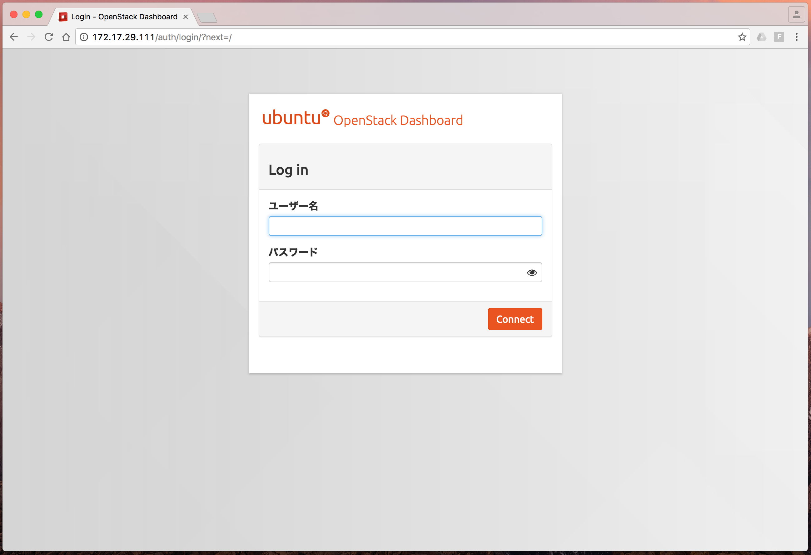

必要に応じて[公式マニュアル](http://docs.openstack.org/mitaka/ja/install-guide-ubuntu/keystone-users.html
)を参考に、管理ユーザー以外のアカウントを作成してください。


### 5.8 Neutronネットワークの登録
JujuによってデプロイしたOpenStack環境はネットワークは作成されていません。
インスタンスを起動して外部ネットワークと通信できるようにするにはまず、Neutronネットワークを作成する必要があります。
次の流れに従って、Neutronネットワークを登録してください。
設定の具体的な流れは[OpenStack Pike 構築手順書](https://github.com/virtualtech/openstack-pike-docs)を参考にどうぞ。

1. 「プロジェクト > ネットワーク > ネットワーク」でユーザーネットワークを作成(共有オフ)
2. ユーザーサブネットを作成(DHCP有効)
3. 「プロジェクト > ネットワーク > ルーター」でルーターを作成
4. 「管理 > ネットワーク > ネットワーク」でExternalネットワークを作成(ネットワーク種別:flat/物理ネットワーク:physnet1/管理状態有効、外部ネットワークにチェック)
5. Externalサブネットを作成(DHCP無効)
6. 「プロジェクト > ネットワーク > ルーター」でゲートウェイの設定
7. 「プロジェクト > ネットワーク > ルーター」でインターフェイスの追加
8. 「プロジェクト > ネットワーク > ネットワークトポロジ」でネットワークの確認


\clearpage

### 5.9 イメージの登録
Glanceにクラウドイメージを登録します。
コマンドによるイメージの登録については[Image サービスの動作検証](http://docs.openstack.org/mitaka/ja/install-guide-ubuntu/glance-verify.html)を参照してください。OpenStack DashboardからWebインターフェイスの操作により簡単にイメージを登録することもできます。
イメージのダウンロードについては[仮想マシンイメージガイドのイメージの入手](http://docs.openstack.org/ja/image-guide/obtain-images.html)を参照してください。
OpenStack用のLXDイメージについては[Nova LXD のインストールと設定](https://linuxcontainers.org/ja/lxd/getting-started-openstack/)を参照してください。

UbuntuのLXDイメージは[Ubuntu Cloud Images](https://cloud-images.ubuntu.com/releases/)で配布されています。

* [16.04 (Xenial)](https://cloud-images.ubuntu.com/releases/16.04/release/ubuntu-16.04-server-cloudimg-amd64-root.tar.gz)
* [14.04 (Trusty)](https://cloud-images.ubuntu.com/releases/14.04/release/ubuntu-14.04-server-cloudimg-amd64-root.tar.gz)

Dashboardによるイメージ登録は次の流れに従って行ってください。

Dashboardでイメージを登録する場合は、イメージをユーザープロジェクトのイメージとして登録する場合とシステムに登録する場合の二つがあります。
汎用できるイメージはシステムに、プロジェクト別にカスタマイズし汎用性のないイメージはユーザープロジェクトのイメージとして登録すると良いでしょう。


#### 5.9.1 システムにイメージを登録する

1. 「管理 > システム > イメージ」を開く
2. 「イメージの作成」ボタンを押下
3. 名前、イメージのソースと場所、形式を入力。全てのユーザーに公開するにはパブリックを設定
4. 「イメージの作成」ボタンを押下

以上でイメージを登録できます。


#### 5.9.2 ユーザープロジェクトのイメージとして登録する

1. 「プロジェクト > コンピュート > イメージ」を開く
2. 「イメージの作成」ボタンを押下
3. 名前、イメージのソースと場所、形式を入力。全てのユーザーに公開するにはパブリックを設定
4. 「イメージの作成」ボタンを押下

以上でイメージを登録できます。

\clearpage

#### 5.9.3 コンピュートノードの振り分け

Nova-LXDとNova-KVMを共存させた場合、インスタンスを起動するときにコンテナーで起動したいのか、KVM仮想マシンとして起動したいのかを指定する必要があります。
これを実現するための手段として、Nova-schedulerの「AggregateInstanceExtraSpecsFilter」を利用します。

これにより、インスタンスを起動する際にmetadataを渡すことで、目的のノードでインスタンスを生成することができるようになります。


##### Nova-scheduler用のフィルターを追加

デフォルトの設定ではNova-schedulerには「AggregateInstanceExtraSpecsFilter」が適用されておらず、追加が必要です。
ここからイメージやフレーバーでNova-KVM,Nova-LXDをNova-schedulerで自動選択するための設定を行います。 次のようにNova-scheduler用のフィルターを追加します。

* Juju GUIを開く
* Nova-cloud-controllersの設定を開く
* 「cheduler-default-filters (string)」にフィルタールール「AggregateInstanceExtraSpecsFilter」を追加
* 「Commit changes」ボタンを押す
* 「Deploy」ボタンを押す


##### Computeノードを確認

現在OpenStackが認識するComputeサービスが実行されているノードを確認します。

```
% openstack host list
+---------------------+-------------+----------+
| Host Name           | Service     | Zone     |
+---------------------+-------------+----------+
| juju-ffbb7b-0-lxd-1 | conductor   | internal |
| juju-ffbb7b-0-lxd-1 | consoleauth | internal |
| juju-ffbb7b-0-lxd-1 | scheduler   | internal |
| physical3           | compute     | nova     | KVM
| physical4           | compute     | nova     | LXD
+---------------------+-------------+----------+
```

\clearpage

##### aggregateを作成

```
% openstack aggregate create --zone nova lxd
+-------------------+----------------------------+
| Field             | Value                      |
+-------------------+----------------------------+
| availability_zone | nova                       |
| created_at        | 2017-10-17T02:04:23.762947 |
| deleted           | False                      |
| deleted_at        | None                       |
| id                | 2                          |
| name              | lxd                        |
| updated_at        | None                       |
+-------------------+----------------------------+
% openstack aggregate create --zone nova kvm
+-------------------+----------------------------+
| Field             | Value                      |
+-------------------+----------------------------+
| availability_zone | nova                       |
| created_at        | 2017-10-17T02:04:31.520429 |
| deleted           | False                      |
| deleted_at        | None                       |
| id                | 4                          |
| name              | kvm                        |
| updated_at        | None                       |
+-------------------+----------------------------+
% openstack aggregate list
+----+----------+-------------------+
| ID | Name     | Availability Zone |
+----+----------+-------------------+
|  2 | lxd      | nova              |
|  4 | kvm      | nova              |
+----+----------+-------------------+
```

##### aggregateにノードを追加

このあとaggregateに設定を行うので、この設定を適用したいノードを登録します。

```
% openstack aggregate add host 2 physical4 
+-------------------+---------------------------------+
| Field             | Value                           |
+-------------------+---------------------------------+
| availability_zone | nova                            |
| created_at        | 2017-10-17T02:04:24.000000      |
| deleted           | False                           |
| deleted_at        | None                            |
| hosts             | [u'physical4']                  |
| id                | 2                               |
| metadata          | {u'availability_zone': u'nova'} |
| name              | lxd                             |
| updated_at        | None                            |
+-------------------+---------------------------------+
% openstack aggregate add host 4 physical3
+-------------------+---------------------------------+
| Field             | Value                           |
+-------------------+---------------------------------+
| availability_zone | nova                            |
| created_at        | 2017-10-17T02:04:32.000000      |
| deleted           | False                           |
| deleted_at        | None                            |
| hosts             | [u'physical3']                  |
| id                | 4                               |
| metadata          | {u'availability_zone': u'nova'} |
| name              | kvm                             |
| updated_at        | None                            |
+-------------------+---------------------------------+
```

##### aggregateの中身を確認

name,hostsを確認して、aggregateに想定した名前、ノードが登録されていることを確認します。

```
% openstack aggregate show 2
+-------------------+----------------------------+
| Field             | Value                      |
+-------------------+----------------------------+
| availability_zone | nova                       |
| created_at        | 2017-10-17T02:04:24.000000 |
| deleted           | False                      |
| deleted_at        | None                       |
| hosts             | [u'physical4']             |
| id                | 2                          |
| name              | lxd                        |
| properties        |                            |
| updated_at        | None                       |
+-------------------+----------------------------+
% openstack aggregate show 4
+-------------------+----------------------------+
| Field             | Value                      |
+-------------------+----------------------------+
| availability_zone | nova                       |
| created_at        | 2017-10-17T02:04:32.000000 |
| deleted           | False                      |
| deleted_at        | None                       |
| hosts             | [u'physical3']             |
| id                | 4                          |
| name              | kvm                        |
| properties        |                            |
| updated_at        | None                       |
+-------------------+----------------------------+
```

##### aggregateにmetadataを設定

aggregateはデフォルトでオフなので、有効化します。 aggregateのpropertiesに設定が追加されていることを確認します。

```
% openstack aggregate set --property lxd=true 2
% openstack aggregate set --property kvm=true 4
% openstack aggregate show 2
+-------------------+----------------------------+
| Field             | Value                      |
+-------------------+----------------------------+
| availability_zone | nova                       |
| created_at        | 2017-10-17T02:04:24.000000 |
| deleted           | False                      |
| deleted_at        | None                       |
| hosts             | [u'physical4']             |
| id                | 2                          |
| name              | lxd                        |
| properties        | lxd='true'                 |
| updated_at        | None                       |
+-------------------+----------------------------+

% openstack aggregate show 4

+-------------------+----------------------------+
| Field             | Value                      |
+-------------------+----------------------------+
| availability_zone | nova                       |
| created_at        | 2017-10-17T02:04:32.000000 |
| deleted           | False                      |
| deleted_at        | None                       |
| hosts             | [u'physical3']             |
| id                | 4                          |
| name              | kvm                        |
| properties        | kvm='true'                 |
| updated_at        | None                       |
+-------------------+----------------------------+
```

##### metadataを設定

フレーバーやイメージに、metadataを設定します。

次のようなカスタムメタデータを作成します。

* aggregate_instance_extra_specs:lxd
* aggregate_instance_extra_specs:kvm

作成したメタデータにtrueを設定します。

\clearpage


### 5.10 セキュリティーグループの設定

次にセキュリティーグループの設定を行います。セキュリティーグループで通信を許可するサービスやポートを設定します。
通常、defaultというセキュリティーグループが用意されています。
これに許可するルールを追加するか、新しいセキュリティーグループを追加してルールを設定します。

インスタンスへのPingを許可するにはICMP、SSHプロトコルによるリモート接続を許可するにはSSHを許可してください。


### 5.11 キーペアの設定

キーペアではインスタンスとの接続に必要な秘密鍵と公開鍵を作成するか、既存の公開鍵をOpenStackに登録できます。

キーペアの作成をすると、OpenStackのインスタンスにアクセスする際に利用できるpemファイルを作成できます。
「キーペアのインポート」は既存の秘密鍵と公開鍵の組み合わせがある場合にそれをリモートアクセスに利用できるように登録できます。

公開鍵の欄に既存の公開鍵をペーストして「キーペアのインポート」ボタンを押下すると登録できます。

いずれの方法で登録したキーペアはインスタンス起動時に指定してください。

SSHアクセスする場合は-iオプションで公開鍵を指定して、インスタンスにアクセスできます。アクセスできない場合は`-vvv`を追加してみましょう。

```
$ ssh -i cloud.key <username>@<instance_ip>
```

\clearpage


### 5.12 インスタンスの起動

インスタンスを起動するには次の2通りの方法があります。

「プロジェクト > コンピュート > イメージ」を開き、イメージを選択して「起動」を押下するか、
「プロジェクト > コンピュート > インスタンス」を開き、「インスタンスの起動」を押下するとインスタンスを起動できます。
インスタンスの起動ウィザードが表示されますので、画面の指示に従ってインスタンスの情報を入力してください。※印のある項目は必須入力項目です。

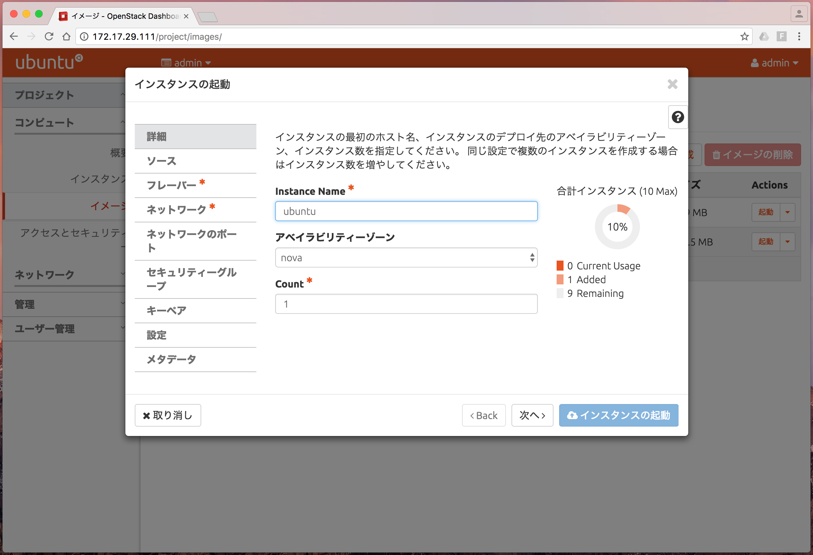

起動したインスタンスは一覧で表示されます。

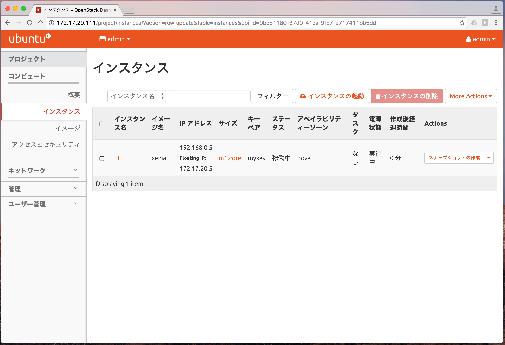

インスタンス名をクリックして「ログ」タブを押下すると、インスタンス起動時のコンソールのログが表示できます。
「すべてのログの表示」ボタンを押下すると、起動から起動完了までのログをすべて表示できます。

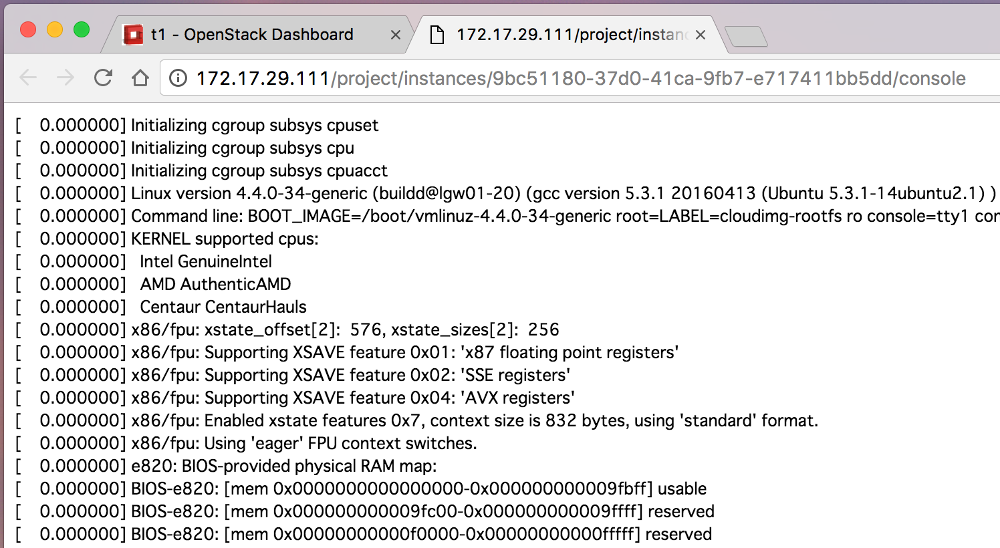


\clearpage


### 5.13 サービスのクラスター化

デフォルトでクラスターを想定していないアプリケーションのクラスター化にはCorosync/Pacemakerを用いた[Haclusterチャーム](https://jujucharms.com/hacluster/)を利用します。

以下はシングルノードで動かしていた「openstack-dashboard」を冗長化する例です。

```
% juju add-unit openstack-dashboard --to lxd:1

% juju deploy hacluster dashboard-hacluster    ←dashboard-haclusterという名前でデプロイ
% juju config dashboard-hacluster cluster_count="2"    ←3冗長以下の場合は設定を変更
% juju config openstack-dashboard vip="172.17.29.195"    ←VIPの指定
% juju add-relation openstack-dashboard dashboard-hacluster
```

VIPに指定したノードに`juju ssh`コマンドでログインし、Apacheのアクセスログを見ると、openstack-dashboardの各アドレスでアクセスするとアクセスログが追記されていくのが確認できます。VIPとして設定しなかったノードはアクセスログが追記されません。

```
# tailf /var/log/apache2/access.log

172.17.29.197 - - [22/Sep/2017:06:36:15 +0000] "GET /auth/login/ HTTP/1.1" 200 3853 "-" "Mozilla/5.0 (Macintosh; Intel Mac OS X 10_12_6) AppleWebKit/604.1.38 (KHTML, like Gecko) Version/11.0 Safari/604.1.38"

172.17.29.195 - - [22/Sep/2017:06:36:34 +0000] "GET /auth/login/ HTTP/1.1" 200 3855 "-" "Mozilla/5.0 (Macintosh; Intel Mac OS X 10_12_6) AppleWebKit/604.1.38 (KHTML, like Gecko) Version/11.0 Safari/604.1.38"
```
